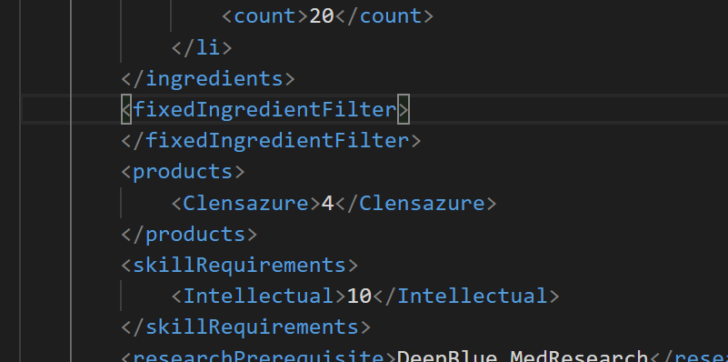

# rwxml language server
Language Server implementation for rimworld xml modding  


## but why?

As the limitation of xml modding, most modders have similar problems.  
Searching defs, open decompiler and read what field the class have,  
use time figuring out what this node does, continuously re-open the game just to find typo...  
these things make modding difficult, ** which can be avoided. **

## Installation
install via vscode marketspace

## Getting started

you have to put `rwconfigrc.json` in the root directory of your mod.  
note that only one config file is allowed in the entire project file.

### Config file schema
```json5
{
	"folders": {
		"1.1": { // 1.1 mod
			"About": "path/to/def", // absoulte or relative path
			"Defs": "C:/path/to/mod/def", // note that you should replace "\\" to "/"
			"DefReferences": [ // refernece to core, or other dependency mods.
				"absolute/path/to/def", 
				"realtive/path/to/def"
			],
			"AssemblyReferences": [ // referencing dll files to extract typeInfos.
				"absoulte/path/to/Rimworld/Assembly-CSharp.dll", // use absolute path
				"relative/path/to/your/assemblies/my-assembly.dll", // use relative path
				"path/to/folder/loadall" // take all dlls from given path
			]
		},
		"1.2" : { // 1.2 mod
			// ...
		}
	}
}
```

you can use absolute or relative path.  
rwconfigrc.json will be an anchor to resolve relative path.

# features

- [x] XML Node tag suggestion
- [x] dynamic type extraction
- [x] Inheritance Attribute suggestion
- [ ] Texture preview
- [ ] Texture path suggestion
- [ ] Rename defName / Name in all files
- [ ] find parent / childrens
- [x] AlienRace / Garam support

# Validation

- [x] Def reference validation
- [ ] primitive value validation
- [x] invalid (typo) / duplicate node validation
- [ ] whitespace error validation
- [ ] Texture path validation

# Documentation

TODO

# Development
### Prerequisites
1. node.js
2. dotnet Core

### Setup
```
git clone https://github.com/zzzz465/rwxml-language-server
npm install
```