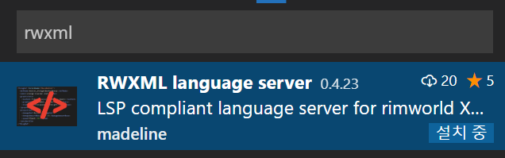

# rwxml language server

[insert image here]  


Language Server implementation for rimworld xml modding  


## Installation
install via vscode marketspace


## Getting started

you have to put `rwconfigrc.json` in the root directory of your mod.  
note that only one config file is allowed in the entire project file.

### Config file schema
```json5
{
	"folders": {
		"1.1": { // 1.1 mod
			"About": "path/to/def", // absoulte or relative path
			"Defs": "C:/path/to/mod/def", // note that you should replace "\\" to "/"
			"DefReferences": [ // refernece to core, or other dependency mods.
				"absolute/path/to/def", // provide folder path
				"realtive/path/to/def"
      ],
			"AssemblyReferences": [ // referencing dll files to extract typeInfos.
				"C:/Path/To/Assembly_Folder_Path", // give folder path to load all dlls
				"relative/path/to/your/assemblies/my-assembly.dll", // give exact dll
			]
		},
		"1.2" : { // 1.2 mod
			// ... fill your datas...
		}
	}
}
```

you can use absolute or relative path.  
rwconfigrc.json will be an anchor to resolve relative path.

# (TO-DO) requested features
- [x] [XML Node tag suggestion]
- [x] dynamic type extraction
- [x] Inheritance Attribute suggestion
- [x] AlienRace / Garam support
- [x] text decoration
- [x] incremental update & validation
- [ ] codelens functionality
- [ ] Texture preview
- [ ] Texture path suggestion
- [x] find parent / childrens
- [ ] Rename defName / Name in all files
- [ ] patch operation snippets

# Validation

- [x] Def reference validation
- [x] invalid (typo) / duplicate node validation
- [x] primitive value validation
- [x] whitespace error validation
- [ ] Texture path validation
- [ ] essential node validation  
... and more!  

# Documentation

TODO

## but why? - motivations, etc...

As the limitation of xml modding, most modders have similar problems.  
Searching defs, open decompiler and read what field the class have,  
use time figuring out what this node does, continuously re-open the game just to find typo...  
these things make modding difficult, **which can be avoided.**


# Development
### Prerequisites
1. node.js 10 or higher
2. dotnet framework 4.7.1 or higher

additionaly, RimWorld is required to debug C# extractor

### Setup
```
git clone https://github.com/zzzz465/rwxml-language-server
npm install
*fix reference in sln project*
```

# Donations
this is free, open-source. but if you like my work, please consider buy me a coffie!  
https://ko-fi.com/madeline_modding  
